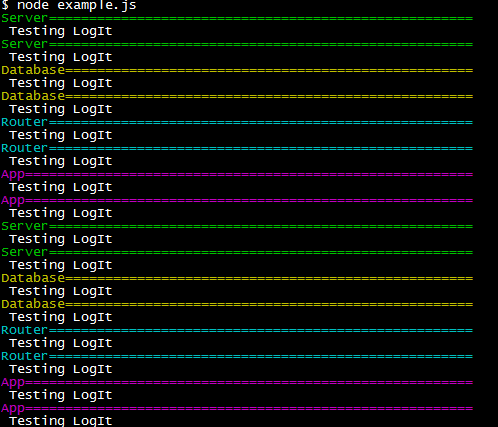

## logIt
A colorful logging utility to help you with Node.js application debugging


## To Install
#### Use npm:
```bash
$ npm install orz-logit
```

## To Use
#### 1. Import to top of the file:
```javascript
const { LogIt, ErrorIt } = require('logIt');
```
#### 2. Define the debug flag, title, mark and color (you can also set 'len' to change the length of repeating marks, default is 60):
```javascript
const logIt = LogIt(true, { title: 'Test', mark:'=', color:'green' });
```
#### 3. Then just call it like console.log:
```javascript
if (error) {
  logIt(error);
}
```
#### 4. Set debug flag to false to turn off all logging, no comments needed:
```javascript
const logIt = LogIt(false, { title: 'Test', mark:'=', color:'green' });
```

## Text colors are dependent of colors module done by Marak
 - black
 - red
 - green
 - yellow
 - blue
 - magenta
 - cyan
 - white
 - gray
 - grey
